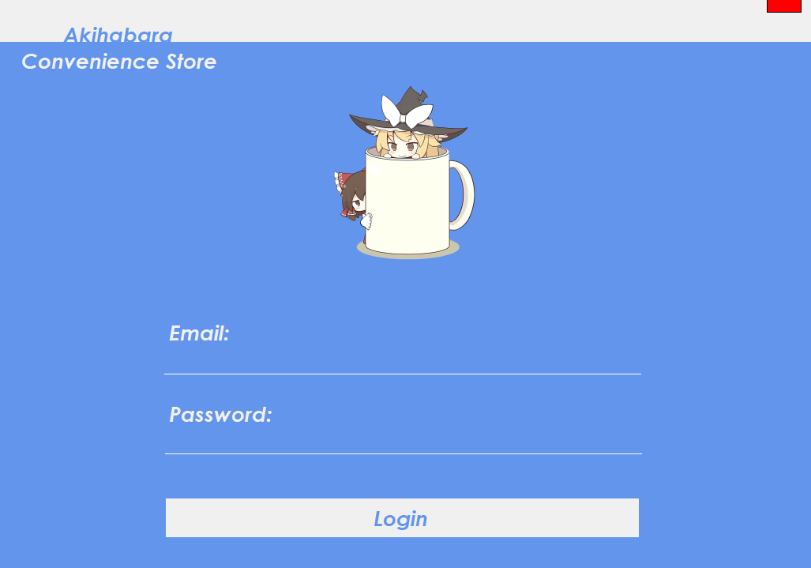
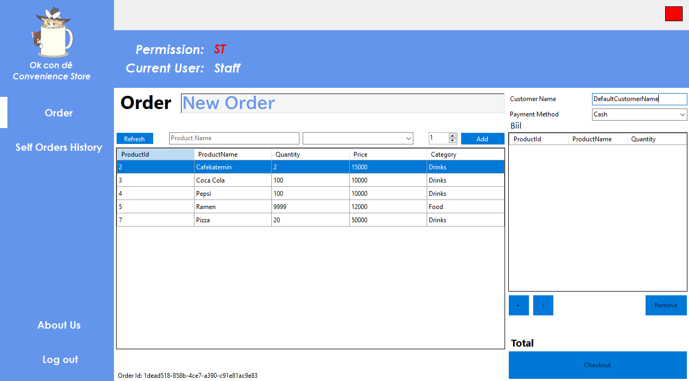
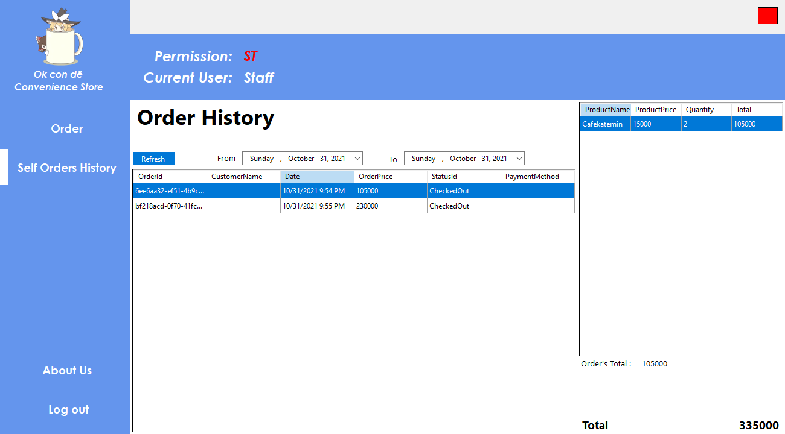
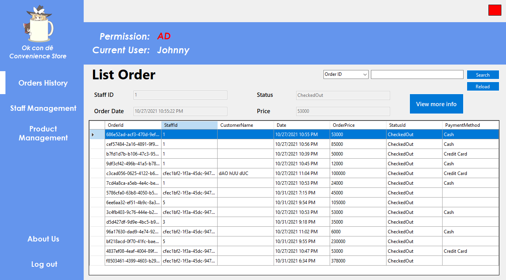
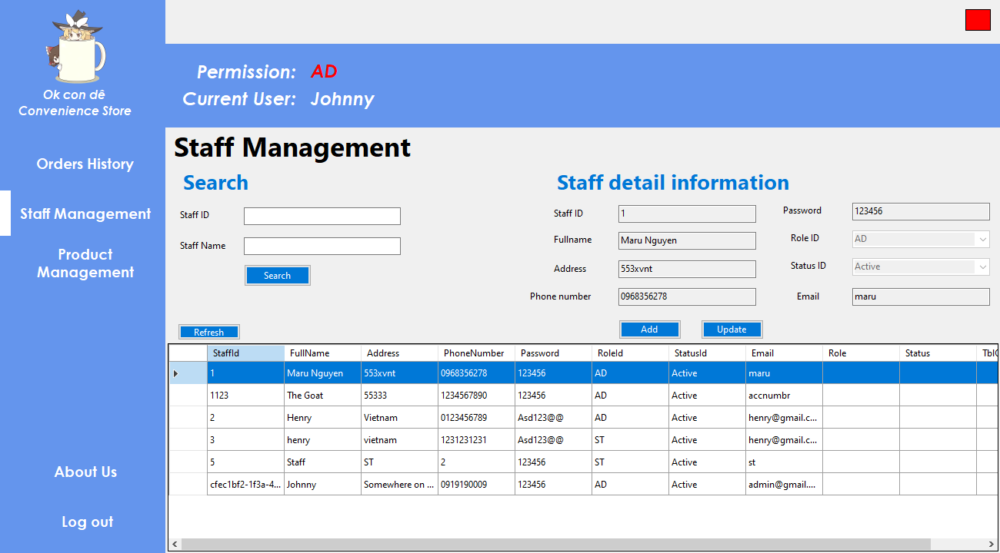
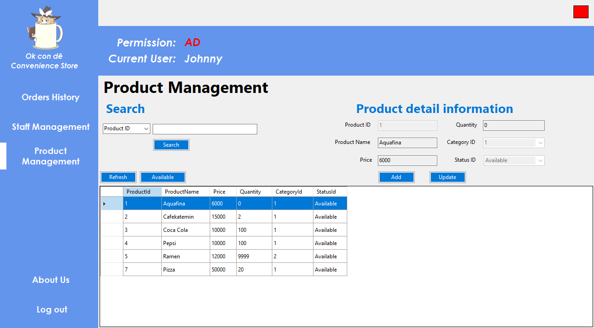

# Group Project
This is a group project for our PRN211 Course from FPT University.
The project was built on .NET 5.0

# Description
This a is simple convenience store management system.

- The program support authentication for 2 types of account
  - Staff: Allowed to make orders and view their own orders
  - Admin: Allowed to manage all staff, orders, and products

## Members
- Our project includes 4 members :
  - [**Đào Hữu Đức**](https://github.com/kaizer7121)
  - [**Trần Nhĩ Hào**](https://github.com/CaptainNemoTNH)
  - [**Trần Đăng Khoa**](https://github.com/Johnnymc2001)
  - [**Nguyễn Nam Hoàng Long**](https://github.com/MaruLd)

# Function
- System contains 4 kind of users type : Admin and Staff

| Function        | Admin | Staff |
| --------------- | ----- | ----- |
| Authentication  | X     | X     | 
| Manage Orders   | X     |       |
| Manage Staffs   | X     |       |
| Manage Products | X     |       |
| Make Order      |       | X     |
| View Self Orde  |       | X     |

# Implementation
# Login 

# Staff Function
## Make Order

## View Staffs' Order

# Admin Function
## Manage Order

## Manage Staff

## Manage Product

